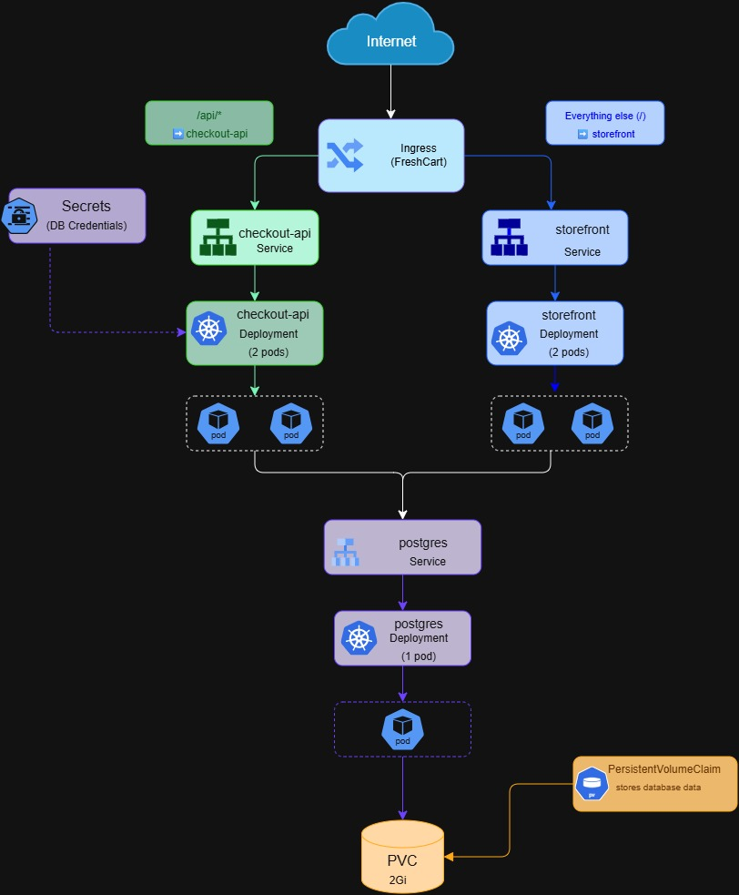

# FreshCart on Kubernetes

Deploys FreshCart's `checkout-api` and `storefront` services to Kubernetes, building on the Terraform-provisioned GCP infrastructure and the CI/CD pipeline from earlier weeks of this capstone series.

The cluster is built and validated locally with **Kind** first, then the same manifests are applied to **GKE** with two environment-specific overrides (image registry, Ingress class).

## Architecture

```
                         Internet
                            │
                            ▼
                        Ingress
                 (nginx locally / GCE on GKE)
                 /api ──────────┬────── /
                    │                   │
                    ▼                   ▼
          checkout-api Service   storefront Service
            (ClusterIP)             (ClusterIP)
                    │                   │
                    ▼                   ▼
          checkout-api Deployment  storefront Deployment
             (2 pods, HPA 2-5)        (2 pods)
                    │
                    ▼
            postgres Service
                    │
                    ▼
          postgres Deployment (1 pod)
                    │
                    ▼
                   PVC
```




See [arch-decisions.md](./docs/arch-decisions.md) for the reasoning behind running Postgres in-cluster, and why that choice is scoped to this capstone rather than a production recommendation.

## Repo structure

```
k8s/
  00-namespace.yaml
  01-secret.example.yaml     # redacted; real secret created imperatively, never committed
  02-postgres.yaml
  03-checkout-api-deployment.yaml
  04-checkout-api-service.yaml
  05-storefront-deployment.yaml
  06-storefront-service.yaml
  07-ingress.yaml             # local (nginx) version
  08-ingress.gke.yaml         # GKE (GCE) version
  09-hpa.yaml
  10-rbac.yaml
diagrams/
  topology.png
docs/
  ARCHITECTURE.md
```

## Components

| Resource | Replicas | Notes |
|---|---|---|
| `checkout-api` Deployment | 2 (autoscales 2–5) | liveness/readiness probes on `/healthz`; DB connection string injected from a Secret |
| `storefront` Deployment | 2 | Week 4 nginx-based image |
| `postgres` Deployment | 1 | backed by a PVC — see ARCHITECTURE.md |
| `checkout-api` / `storefront` Services | — | ClusterIP, fronted by one Ingress |
| Ingress | — | `/api` → checkout-api, everything else → storefront |
| HorizontalPodAutoscaler | — | targets `checkout-api`, 70% CPU, min 2 / max 5 |
| Role + RoleBinding | — | namespace-scoped deploy permissions, no cluster-wide access |

## Running it locally (Kind)

```bash
kind create cluster --name freshcart
kubectl create namespace freshcart

# load locally built images into the Kind node (Kind can't pull from the local Docker daemon by name)
kind load docker-image checkout-api:local --name freshcart
kind load docker-image storefront:local --name freshcart

# ingress controller (Kind needs this installed manually; GKE provides one by default)
kubectl apply -f https://raw.githubusercontent.com/kubernetes/ingress-nginx/main/deploy/static/provider/kind/deploy.yaml

kubectl create secret generic checkout-db-secret \
  --namespace freshcart \
  --from-literal=DATABASE_URL="postgres://<username>:<password>@postgres:5432/freshcart"

kubectl apply -f manifests/
kubectl -n freshcart get pods,svc,ingress,hpa
```

Reach the app through the ingress controller:
```bash
kubectl -n ingress-nginx port-forward svc/ingress-nginx-controller 8080:80
curl http://localhost:8080/
curl http://localhost:8080/api/healthz
```

## Deploying to GKE

```bash
gcloud container clusters create-auto freshcart-gke \
  --region us-central1 --project freshcart-twotier
gcloud container clusters get-credentials freshcart-gke \
  --region us-central1 --project freshcart-twotier
```

Swap the `image:` field in `manifests/03-checkout-api.yaml` and `04-storefront.yaml` to the Artifact Registry path, and apply `manifests/05-ingress.gke.yaml` instead of the local Ingress. Everything else is identical to the local setup.

```bash
kubectl -n freshcart get ingress -w   # wait for an external IP
```

## Verified behavior

- **Self-healing:** deleting a `checkout-api` pod by hand produces a replacement automatically; see `docs/ARCHITECTURE.md` and the capstone blog post for timestamped evidence.
- **Rolling updates:** changing the `checkout-api` image tag and running `kubectl rollout status` completes with zero failed requests, verified with a continuous curl loop against `/api/healthz` during the rollout.
- **Autoscaling:** `checkout-api`'s HPA (min 2, max 5, target 70% CPU) was load-tested with a `busybox` pod hammering the service — it scaled up to 5 replicas under load and back down to 2 once the load pod was removed.

## Related

- Capstone blog series: Two-tier architecture → Dockerizing the services → Terraform on GCP → CI/CD pipeline → **this Kubernetes deployment**
- Builds on the GCP infrastructure provisioned in the Terraform capstone and the images built/pushed by the GitHub Actions pipeline in the CI/CD capstone
